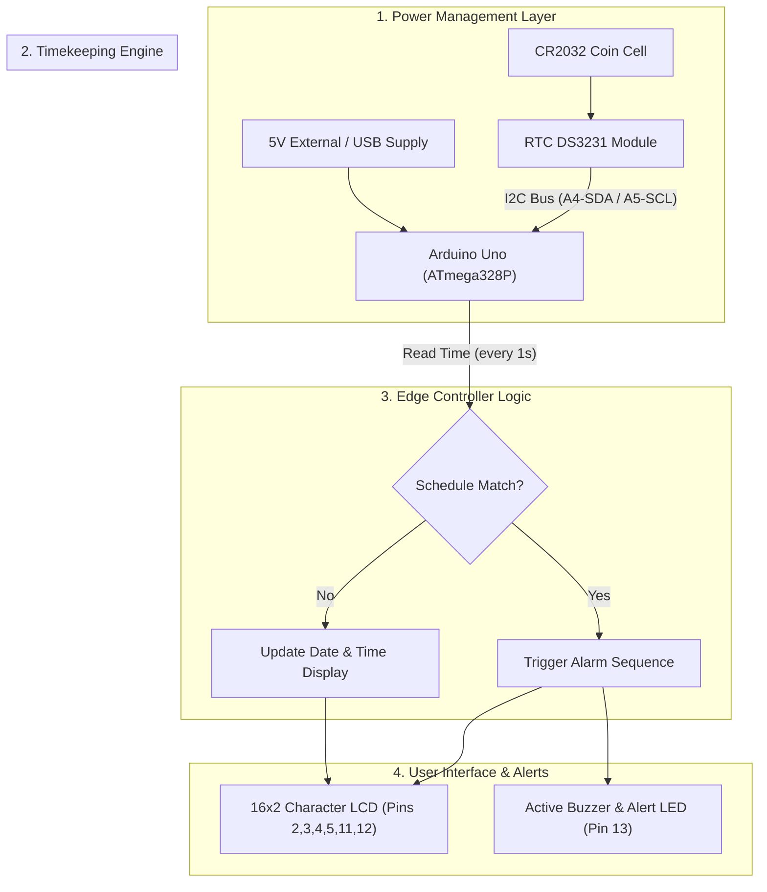

# Automatic Medicine Reminder Box using Arduino

[](https://www.arduino.cc/)
[](https://www.arduino.cc/)
[]()
[](LICENSE)
[](Automatic_Medicine_Reminder_Box_Report.pdf)

An embedded healthcare automation prototype designed to improve medication adherence in elderly and chronically ill patients[cite: 20]. The system utilizes a battery-backed **DS3231 Real-Time Clock (RTC)**, an **HD44780-compatible 16x2 LCD**, and active auditory/visual alert peripherals on an **Arduino Uno** microcontroller to track time and trigger pre-programmed dosage schedules autonomously[cite: 20].

---

> ### ⚠️ Academic Project Context
> This repository documents an undergraduate **Level 2, Term II (2-2)** academic coursework group project completed for **Digital Logic Design Sessional (EEE 228)** in the Department of Biomedical Engineering at Chittagong University of Engineering & Technology (CUET)[cite: 20].
> * **Status**: Educational proof-of-concept prototype built for laboratory demonstration[cite: 20].
> * **Project Report**: Complete documentation is available in [`Automatic_Medicine_Reminder_Box_Report.pdf`](Automatic_Medicine_Reminder_Box_Report.pdf)[cite: 20].

---

## System Architecture



---

## Hardware Pinout & Wiring Specifications

| Component / Peripheral | Arduino Uno Pin | Protocol / Signal Type | Operating Specs | Description |
| :--- | :--- | :--- | :--- | :--- |
| **RTC DS3231 (SDA)** | `A4`[cite: 20] | I2C Data[cite: 20] | 3.3V / 5V[cite: 20] | Real-time date/time communication bus[cite: 20] |
| **RTC DS3231 (SCL)** | `A5`[cite: 20] | I2C Clock[cite: 20] | 3.3V / 5V[cite: 20] | Synchronous clock line for RTC[cite: 20] |
| **16x2 LCD (RS)** | `D12`[cite: 20] | Digital Output[cite: 20] | 5V TTL[cite: 20] | Register select pin[cite: 20] |
| **16x2 LCD (EN)** | `D11`[cite: 20] | Digital Output[cite: 20] | 5V TTL[cite: 20] | Enable pulse pin[cite: 20] |
| **16x2 LCD (D4–D7)** | `D5`, `D4`, `D3`, `D2`[cite: 20] | 4-bit Parallel Bus[cite: 20] | 5V TTL[cite: 20] | High-nibble character data transmission[cite: 20] |
| **Buzzer & Alert LED** | `D13`[cite: 20] | Digital Output[cite: 20] | 5V (Active HIGH)[cite: 20] | Auditory buzzer and visual reminder alert[cite: 20] |
| **10kΩ Potentiometer** | `V0` (LCD Pin 3)[cite: 20] | Analog Voltage Divider[cite: 20] | $0 - 5\text{V}$[cite: 20] | Adjusts LCD contrast[cite: 20] |

---

## Pre-Programmed Medication Schedule

The firmware continuously compares the current RTC timestamp against predefined daily slots[cite: 20]:

| Slot Name | Trigger Time | Alert Message | Indicator Behavior |
| :--- | :--- | :--- | :--- |
| **Morning Slot**[cite: 20] | `01:16:00` (Demo test)[cite: 20] | `Reminder: Morning Medicine`[cite: 20] | Buzzer tone + LCD alert for 30s[cite: 20] |
| **Evening Slot**[cite: 20] | `18:00:00`[cite: 20] | `Reminder: Evening Medicine`[cite: 20] | Buzzer tone + LCD alert for 30s[cite: 20] |
| **Night Slot**[cite: 20] | `22:00:00`[cite: 20] | `Reminder: Goodnight Medicine`[cite: 20] | Buzzer tone + LCD alert for 30s[cite: 20] |

---

## Repository Structure

```text
automatic-medicine-reminder-arduino/
├── .gitignore
├── LICENSE
├── README.md
├── Automatic_Medicine_Reminder_Box_Report.pdf
└── src/
    └── medicine_reminder.ino
```

---

## Getting Started

### Required Libraries
Install the following via the Arduino IDE Library Manager (**Sketch** $\rightarrow$ **Include Library** $\rightarrow$ **Manage Libraries...**):
* `RTClib` (by Adafruit)
* `LiquidCrystal` (built-in)
* `Wire` (built-in)

### Flashing the Microcontroller
1. Wire the components according to the pinout table above[cite: 20].
2. Open `src/medicine_reminder.ino` in the Arduino IDE[cite: 20].
3. Under **Tools** $\rightarrow$ **Board**, select **Arduino Uno**[cite: 20].
4. Select your serial port under **Tools** $\rightarrow$ **Port**.
5. Click **Upload** (`Ctrl + U`).

---

## Authors

* **Dip Muhuri** (ID: 2011008) - *Department of Biomedical Engineering, CUET* - [u2011008@student.cuet.ac.bd](mailto:u2011008@student.cuet.ac.bd)[cite: 20]
* **Sifat Chowdhury** (ID: 2011015) - *Department of Biomedical Engineering, CUET* - [u2011015@student.cuet.ac.bd](mailto:u2011015@student.cuet.ac.bd)[cite: 20]
* **Nizam Uddin Babu** (ID: 2011018) - *Department of Biomedical Engineering, CUET* - [u2011018@student.cuet.ac.bd](mailto:u2011018@student.cuet.ac.bd)[cite: 20]
* **Dip Paul** (ID: 2011025) - *Department of Biomedical Engineering, CUET* - [u2011025@student.cuet.ac.bd](mailto:u2011025@student.cuet.ac.bd)[cite: 20]
* **Jannatul Mawa Taki** (ID: 2011027) - *Department of Biomedical Engineering, CUET* - [u2011027@student.cuet.ac.bd](mailto:u2011027@student.cuet.ac.bd)[cite: 20]

**Academic Supervisor**:  
* **Dr. Sumit Majumder** - *Assistant Professor, Department of Biomedical Engineering, CUET*[cite: 20]

---

## Citation

```bibtex
@misc{medicine_reminder_2026,
  author = {Dip Muhuri, Sifat Chowdhury, Nizam Uddin Babu, Dip Paul and Jannatul Mawa Taki},
  title = {Automatic Medicine Reminder Box using Arduino},
  year = {2026},
  note = {Undergraduate Coursework Project, Digital Logic Design Sessional (EEE 228), Department of Biomedical Engineering, Chittagong University of Engineering and Technology (CUET)}
}
```
